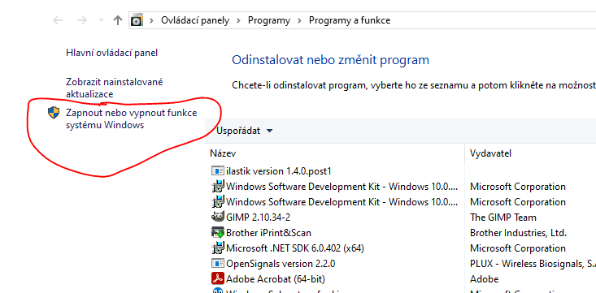

# Jax_wsl2_cuda

## WSL2:
- jednoduchý vyrtuální linux běžící na windows
- příkazová řádka co otevře i gui aplikace
- jde snadno stupustit, vidí v /mnt soubory windows
- funguje i cuda

Postup
- zapnout ve funcích windows

- restartovat počítač
- v powershellu nastavit wsl na verzi 2: wsl --set-default-version 2
- pres microsoft store nainstalovat ubuntu a spustit
cuda
- aktuální ovladače přes geforce experience mi normálně fungovali
- nvidia-smi by mělo fungovat
- nesmíš nainstalovat ovladače ale jen cuda - takto https://developer.nvidia.com/cuda-downloads?target_os=Linux&target_arch=x86_64&Distribution=WSL-Ubuntu&target_version=2.0&target_type=deb_local
- nastavit cuda do path  export PATH=/usr/local/cuda/bin:$PATH (nebo do spouštěcího sriptu ať se udělá pokaždé samo)
- postupoval sem podle https://docs.nvidia.com/cuda/wsl-user-guide/index.html

## Jax pres mambu
- wget https://github.com/conda-forge/miniforge/releases/latest/download/Mambaforge-Linux-x86_64.sh
- bash Mambaforge-Linux-x86_64.sh (init ano potvď a restartuj terminal)
- mamba env create --prefix /home/.../mamba_env
- mamba activate  /home/.../mamba_env
- pip install --upgrade "jax[cuda12_pip]" -f https://storage.googleapis.com/jax-releases/jax_cuda_releases.html (podle https://jax.readthedocs.io/en/latest/installation.html)
- spyder (mělo by se normálně otevřít okno a všechno fungovat)

## další
dobrý editor textu - gnome-text-editor
inicializační skript kam dát export PATH=/usr/local/cuda/bin:$PATH ~/.bashrc
